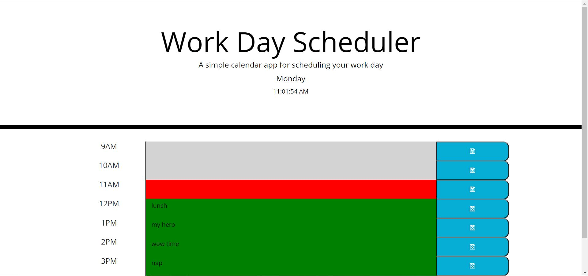

## Day Planner

## Description 

For this week's challenge, we were given the task of creating a work day planner, that meant it had to display 8 hour long blocks that one might associate with a regular work day. Each of the blocks was to consist of a text area and submit button that would log any changes to local storage for retrieval later.

## Breakdown

Starting out on this project was a big challenge, I felt like I was ready for it and had no idea where to start. After a little tinkering i first started work on being able to dynamically create the 8 time block and all the corresponding attributes.

After I accomplished my first goal I set about getting  moment.js to display the correct colors we were to have on each time block based on if it was, past, present or future. Along the way I had a little fun with moment.js and I would like to explore it more thoroughly like some of my other colleagues. 

After getting the correct color displays. I tackled getting everything into local storage as an object, though it works on a day to day basis it is lacking in that i can't change days and only applies to the one day, which is another area i would like to explore. 

## Usage 

Each time block contains a text field which is updatable. Moment.js captures the time, which allows me to display the current day, have a clock which continues to count and capture the current hour. Which is what is used in a comparison to check against the hour of each time block to give it the correct color.

The user can click on any of the submit buttons and the entries series of time blocks in captured and uploaded to local storage and each time the page is refreshed the old data is pulled from local storage and populated to each of the corresponding time blocks

## Links And Images

https://ben-j-st.github.io/hw5-workday-scheduler/
 